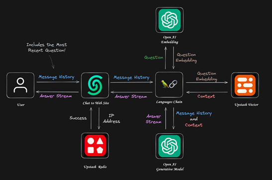
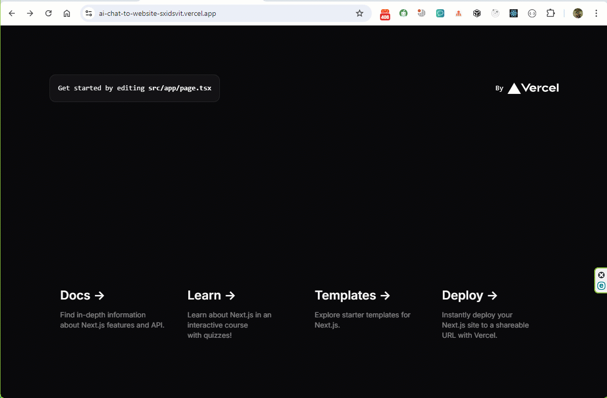

## Modern AI Chatbot 

### Chat with any website: а complete project example with RAGChat & Next.js 14

### Tech Stack

- [Upstash](https://upstash.com/) - serverless databases with *Radis* & *Vector*, messaging for the serverless
- [Vercel AI SDK](https://sdk.vercel.ai/docs/introduction) - TypeScript toolkit designed to help developers build AI-powered applications with React, Next.js
- Next.js 14
- TypeScript 
- Tailwind CSS
- [NextUI](https://nextui.org/) - Beautiful, fast and modern React UI library

### Core Application Idea 

Retrieval Augmented Generation (RAG) approach has emerged as a powerful technique. RAG combines the strengths of both retrieval-based and generative models, offering a nuanced solution for chatbots. At its core, RAG leverages a retriever to search through a vast amount of data. This retrieved information then augments the generative model's ability to produce accurate responses.

QStash acts as a middleman between you and an API to guarantee delivery, perform automatic retries on failure.

<br/>



---

[SITE](https://ai-chat-to-website-sxidsvit.vercel.app/)



### Tech Stack

- [Upstash](https://upstash.com/) serverless databases with Radis & Vector, messaging for the serverless
- [Vercel AI SDK](https://sdk.vercel.ai/docs/introduction) - TypeScript toolkit designed to help developers build AI-powered applications with React, Next.js
- Next.js 14
- TypeScript 
- Tailwind CSS
- [NextUI](https://nextui.org/) - Beautiful, fast and modern React UI library


**Cloning the Repository**

```bash
git clone https://github.com/sxidsvit/ai-chat-to-website.git 
cd appwrite-questions-flow
```

**Installation**

Install the project dependencies using npm:

```bash
bun install
```

**Set Up Environment Variables**

```env

UPSTASH_VECTOR_REST_URL=
UPSTASH_VECTOR_REST_TOKEN=

QSTASH_TOKEN=

UPSTASH_REDIS_REST_URL=
UPSTASH_REDIS_REST_TOKEN=
```


**Running the Project**

```bash
bun run dev
```

Open [http://localhost:3000](http://localhost:3000) in your browser to view the project.


---

##### Contact with me:

[][linkedin]

[linkedin]: https://www.linkedin.com/in/sergiy-antonyuk/


##### I can't express how much I have learned from [you](https://www.youtube.com/@joshtriedcoding/) ! <br> Thanks for the hard and smart work.
